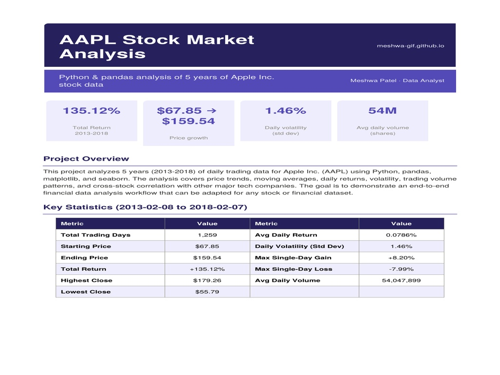
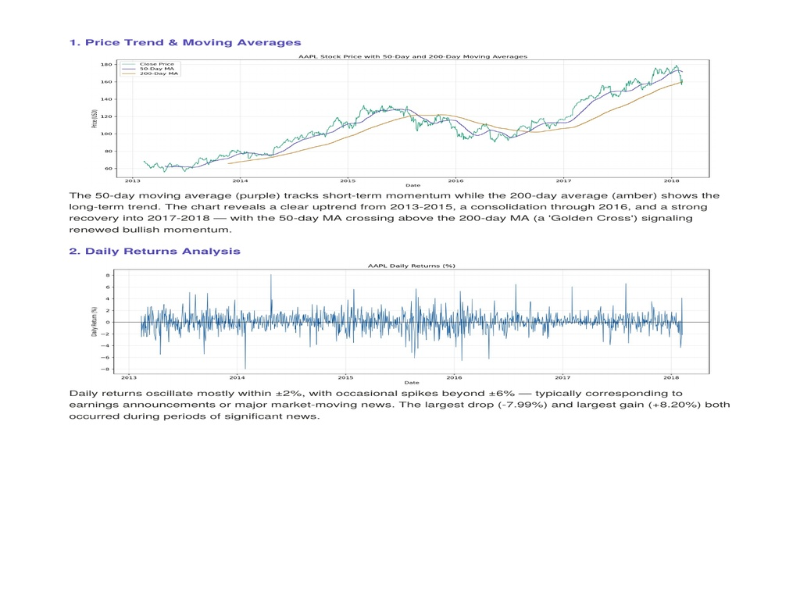
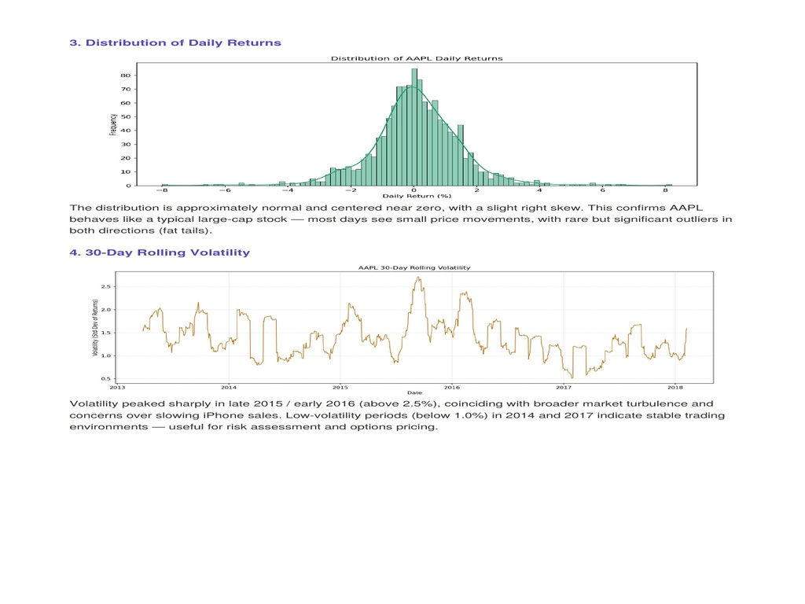
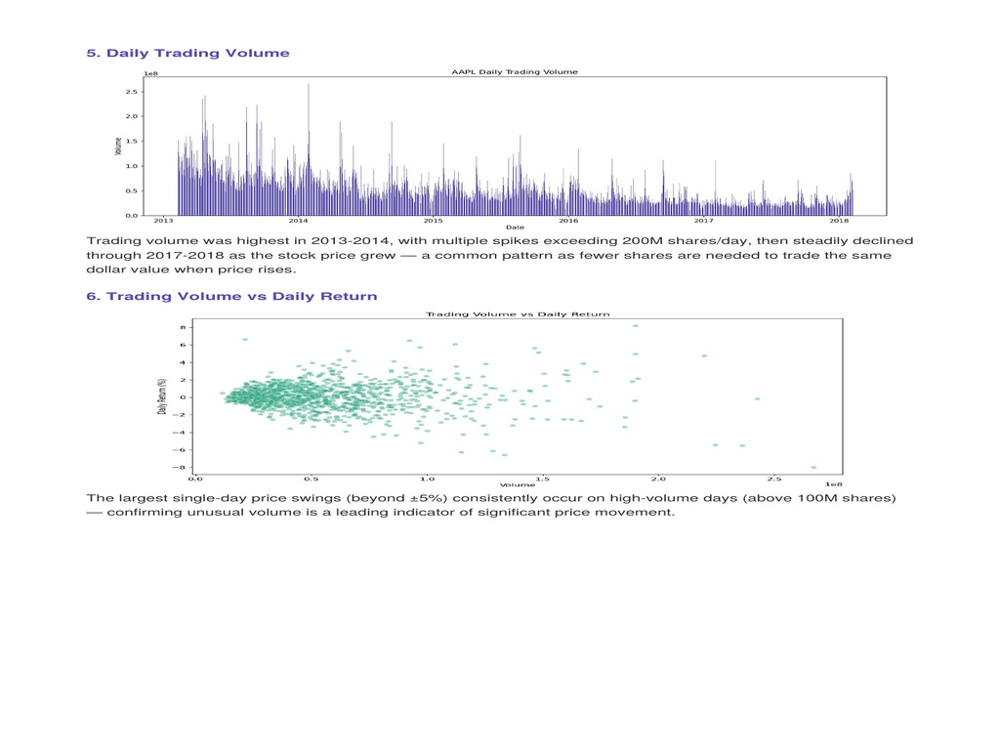
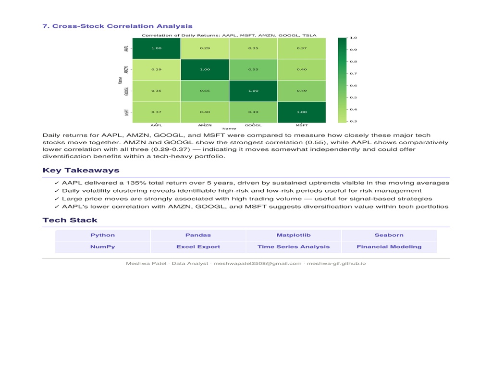

# AAPL Stock Market Analysis — Python Financial Analytics

End-to-end financial analysis of **5 years (2013–2018) of Apple Inc. (AAPL) daily trading data** — covering price trends, moving averages, daily returns, volatility clustering, trading volume patterns, and cross-stock correlation with AMZN, GOOGL, MSFT, and TSLA.

---

## Analysis Preview

---

## Key Results

| Metric | Value |
|--------|-------|
| Total Return (2013–2018) | **+135.12%** |
| Starting Price | $67.85 |
| Ending Price | $159.54 |
| Total Trading Days | **1,259** |
| Highest Close | $179.26 |
| Lowest Close | $55.79 |
| Avg Daily Return | 0.0786% |
| Daily Volatility (Std Dev) | **1.46%** |
| Max Single-Day Gain | +8.20% |
| Max Single-Day Loss | -7.99% |
| Avg Daily Volume | 54,047,899 shares |

---

## 7 Analyses Performed

### 1. Price Trend & Moving Averages

50-day and 200-day moving averages plotted against daily close price. Identified a **Golden Cross** signal (50-day MA crossing above 200-day MA) in 2017, signaling renewed bullish momentum. Clear uptrend from 2013–2015, consolidation through 2016, strong recovery into 2017–2018.

---

### 2. Daily Returns Analysis
Daily returns oscillate mostly within ±2%, with occasional spikes beyond ±6% — typically corresponding to earnings announcements or major market-moving news. Largest drop: **-7.99%**. Largest gain: **+8.20%**.

---

### 3. Distribution of Daily Returns

Distribution is approximately normal and centered near zero with a slight right skew — confirming AAPL behaves like a typical large-cap stock with rare but significant outliers (fat tails).

---

### 4. 30-Day Rolling Volatility
Volatility peaked sharply in late 2015 / early 2016 (above 2.5%), coinciding with broader market turbulence and concerns over slowing iPhone sales. Low-volatility periods (below 1.0%) in 2014 and 2017 indicate stable trading environments — useful for risk assessment and options pricing.

---

### 5. Daily Trading Volume

Trading volume was highest in 2013–2014, with multiple spikes exceeding 200M shares/day, then steadily declined through 2017–2018 as the stock price grew — a common pattern as fewer shares are needed to trade the same dollar value when price rises.

---

### 6. Trading Volume vs Daily Return
Largest single-day price swings (beyond ±5%) consistently occur on high-volume days (above 100M shares) — confirming **unusual volume is a leading indicator of significant price movement**.

---

### 7. Cross-Stock Correlation Analysis

| Stock Pair | Correlation |
|------------|-------------|
| AAPL vs AMZN | 0.29 |
| AAPL vs GOOGL | 0.35 |
| AAPL vs MSFT | 0.37 |
| AMZN vs GOOGL | 0.55 (strongest) |

AAPL shows comparatively lower correlation with all three peers (0.29–0.37) — indicating it moves somewhat independently and could offer **diversification benefits within a tech-heavy portfolio**.

---

## Key Takeaways

- AAPL delivered a **135% total return** over 5 years, driven by sustained uptrends visible in the moving averages
- Daily volatility clustering reveals identifiable high-risk and low-risk periods — useful for risk management
- Large price moves are strongly associated with high trading volume — useful for signal-based strategies
- AAPL's lower correlation with AMZN, GOOGL, and MSFT suggests **diversification value within tech portfolios**

---

## Tech Stack

`Python` `Pandas` `Matplotlib` `Seaborn` `NumPy` `Excel Export` `Time Series Analysis` `Financial Modeling`

---

## Dataset

- **Source:** Yahoo Finance historical data for AAPL
- **Period:** February 2013 – February 2018
- **Trading Days:** 1,259
- **Fields:** Date, Open, High, Low, Close, Volume, Adj Close
- **Download:** Available via [Yahoo Finance](https://finance.yahoo.com/quote/AAPL/history/) or [Kaggle](https://www.kaggle.com/datasets/tarunpaparaju/apple-aapl-historical-stock-data)

---

## Project Context

Built as part of my data analytics portfolio to demonstrate:
- End-to-end financial data analysis workflow in Python
- Time series analysis and moving average calculation with pandas
- Statistical analysis of return distributions and volatility
- Multi-stock correlation analysis using seaborn heatmaps
- Professional data storytelling with Matplotlib and Seaborn

---

## Author

**Meshwa Patel** — Data Analyst  
[Portfolio](https://meshwa-gif.github.io) · [LinkedIn](https://www.linkedin.com/in/meshwapatel-2b24a8385) · [Email](mailto:meshwapatel2508@gmail.com)
